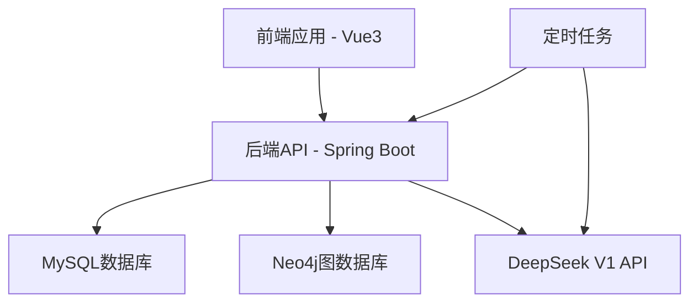

# 事件时间线功能增强系统

本系统是一个事件时间线功能增强系统，用于管理地区信息、生成事件时间线，并通过DeepSeek V1模型进行智能事件关联分析。

## 功能特点

### 地区管理功能

- 创建、更新、删除和查询地区信息
- 管理地区包含的字典项
- 地区引用检查，防止删除被时间线引用的地区

### 时间线生成功能

- 基于多个地区和特定时间范围生成事件时间线
- 异步处理时间线生成，支持进度查询和取消
- 将相关事件智能地组织在同一时间线中

### DeepSeek智能事件关联分析

- 使用DeepSeek V1模型分析事件关联性
- 考虑事件的地点、时间、主体、客体等因素
- 批量处理事件关联分析以提高效率

### 时间线数据存储与展示

- 将时间线信息保存到MySQL数据库
- 将事件关联关系保存到Neo4j图数据库
- 以图形方式展示事件及其关联关系

## 系统架构

系统采用前后端分离的架构：

- 后端：Spring Boot应用
- 前端：Vue 3应用
- 数据库：MySQL关系型数据库和Neo4j图数据库

### 系统组件



## 快速开始

### 环境要求

- JDK 11或更高版本
- Maven 3.6或更高版本
- MySQL 8.0或更高版本
- Neo4j 4.4或更高版本
- Node.js 16或更高版本
- npm 8或更高版本

### 后端启动

1. 配置数据库连接信息：

编辑`src/main/resources/application.properties`文件：

```properties
# 数据库配置
spring.datasource.url=jdbc:mysql://localhost:3306/hot_events?useUnicode=true&characterEncoding=utf8&serverTimezone=Asia/Shanghai
spring.datasource.username=your_username
spring.datasource.password=your_password

# Neo4j配置
spring.neo4j.uri=bolt://localhost:7687
spring.neo4j.authentication.username=your_username
spring.neo4j.authentication.password=your_password

# DeepSeek API配置
deepseek.api.url=https://api.deepseek.com
deepseek.api.key=your_api_key
```

2. 构建和运行后端应用：

```bash
mvn clean package
java -jar target/hot-event-1.0.0.jar
```

或者使用Spring Boot Maven插件：

```bash
mvn spring-boot:run
```

### 前端启动

1. 安装依赖：

```bash
cd frontend
npm install
```

2. 配置API基础URL：

编辑`.env`文件：

```
VUE_APP_API_BASE_URL=http://localhost:8080/api
```

3. 启动开发服务器：

```bash
npm run dev
```

4. 构建生产版本：

```bash
npm run build
```

## 使用指南

### 地区管理

1. 访问地区管理页面
2. 点击"新增地区"按钮创建地区
3. 填写地区信息并提交
4. 在地区列表中可以查看、编辑和删除地区

### 时间线生成

1. 访问时间线页面
2. 点击"生成时间线"按钮
3. 选择一个或多个地区
4. 设置时间范围
5. 提交生成请求
6. 查看时间线生成进度
7. 生成完成后查看时间线详情

### 时间线展示

1. 在时间线列表中点击时间线
2. 查看时间线基本信息
3. 查看时间线包含的地区和事件
4. 查看事件关系图

## API文档

API文档使用Swagger生成，可以通过以下URL访问：

```
http://localhost:8080/swagger-ui/index.html
```

## 测试

### 单元测试

运行单元测试：

```bash
mvn test
```

### 集成测试

运行集成测试：

```bash
./scripts/integration_test.sh
```

### 端到端测试

运行端到端测试：

```bash
python3 ./scripts/e2e_test.py
```

## 部署

详细的部署指南请参考[部署指南](docs/deployment_guide.md)。

## 项目结构

```
hot_event/
├── docs/                  # 文档
│   └── deployment_guide.md  # 部署指南
├── frontend/              # 前端应用
│   ├── public/            # 静态资源
│   └── src/               # 源代码
│       ├── api/           # API客户端
│       ├── assets/        # 资源文件
│       ├── components/    # 组件
│       ├── router/        # 路由
│       ├── store/         # 状态管理
│       ├── utils/         # 工具类
│       └── views/         # 页面
├── scripts/               # 脚本
│   ├── e2e_test.py        # 端到端测试脚本
│   └── integration_test.sh  # 集成测试脚本
├── sql/                   # SQL脚本
│   └── hot_events_db.sql  # 数据库初始化脚本
└── src/                   # 后端源代码
    ├── main/
    │   ├── java/
    │   │   └── com/
    │   │       └── hotech/
    │   │           └── events/
    │   │               ├── common/     # 公共类
    │   │               ├── config/     # 配置类
    │   │               ├── controller/ # 控制器
    │   │               ├── dto/        # 数据传输对象
    │   │               ├── entity/     # 实体类
    │   │               ├── mapper/     # MyBatis映射器
    │   │               ├── repository/ # Neo4j仓库
    │   │               ├── service/    # 服务接口
    │   │               │   └── impl/   # 服务实现
    │   │               ├── task/       # 任务
    │   │               └── util/       # 工具类
    │   └── resources/
    │       ├── application.properties  # 应用配置
    │       └── db/
    │           └── migration/          # 数据库迁移脚本
    └── test/
        └── java/
            └── com/
                └── hotech/
                    └── events/
                        ├── controller/ # 控制器测试
                        └── service/    # 服务测试
```

## 贡献指南

1. Fork项目
2. 创建特性分支 (`git checkout -b feature/amazing-feature`)
3. 提交更改 (`git commit -m 'Add some amazing feature'`)
4. 推送到分支 (`git push origin feature/amazing-feature`)
5. 创建Pull Request

## 许可证

本项目采用MIT许可证 - 详见[LICENSE](LICENSE)文件。

## 联系方式

如有问题，请联系系统管理员或开发团队。