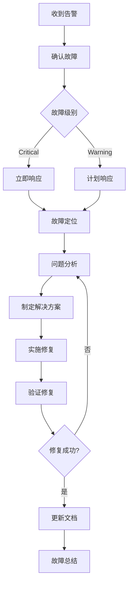

# 时间线DeepSeek集成系统故障排查和监控指南

## 概述

本文档提供了时间线DeepSeek集成系统的故障排查方法、监控策略和性能优化建议，帮助运维人员快速定位和解决系统问题。

## 监控体系架构

```
┌─────────────────┐    ┌─────────────────┐    ┌─────────────────┐
│   应用监控      │    │   基础设施监控   │    │   业务监控      │
│   (Micrometer)  │    │   (Prometheus)  │    │   (Custom)      │
└─────────────────┘    └─────────────────┘    └─────────────────┘
         │                       │                       │
         ▼                       ▼                       ▼
┌─────────────────┐    ┌─────────────────┐    ┌─────────────────┐
│   Grafana       │    │   AlertManager  │    │   日志聚合      │
│   仪表板        │    │   告警管理      │    │   (ELK Stack)   │
└─────────────────┘    └─────────────────┘    └─────────────────┘
```

## 核心监控指标

### 1. 应用性能指标

#### 1.1 HTTP请求指标

```yaml
# 监控指标定义
http_requests_total:
  description: "HTTP请求总数"
  labels: [method, uri, status]
  
http_request_duration_seconds:
  description: "HTTP请求响应时间"
  labels: [method, uri]
  
http_requests_active:
  description: "当前活跃HTTP请求数"
  labels: [method, uri]
```

#### 1.2 DeepSeek API指标

```yaml
deepseek_api_requests_total:
  description: "DeepSeek API请求总数"
  labels: [request_type, status]
  
deepseek_api_response_time_seconds:
  description: "DeepSeek API响应时间"
  labels: [request_type]
  
deepseek_api_rate_limit_remaining:
  description: "DeepSeek API剩余配额"
  
deepseek_api_errors_total:
  description: "DeepSeek API错误总数"
  labels: [error_type]
```

#### 1.3 时间线生成指标

```yaml
timeline_generation_total:
  description: "时间线生成总数"
  labels: [status]
  
timeline_generation_duration_seconds:
  description: "时间线生成耗时"
  
timeline_events_processed_total:
  description: "处理的事件总数"
  
timeline_validation_success_rate:
  description: "事件验证成功率"
```

### 2. 系统资源指标

#### 2.1 JVM指标

```yaml
jvm_memory_used_bytes:
  description: "JVM内存使用量"
  labels: [area]
  
jvm_gc_collection_seconds:
  description: "GC耗时"
  labels: [gc]
  
jvm_threads_current:
  description: "当前线程数"
  
jvm_classes_loaded:
  description: "已加载类数量"
```

#### 2.2 数据库指标

```yaml
database_connections_active:
  description: "活跃数据库连接数"
  
database_connections_idle:
  description: "空闲数据库连接数"
  
database_query_duration_seconds:
  description: "数据库查询耗时"
  labels: [query_type]
  
database_connection_errors_total:
  description: "数据库连接错误总数"
```

### 3. 业务指标

#### 3.1 事件处理指标

```yaml
events_fetched_total:
  description: "获取的事件总数"
  labels: [source, region]
  
events_validated_total:
  description: "验证的事件总数"
  labels: [validation_result]
  
events_stored_total:
  description: "存储的事件总数"
  
events_deduplication_rate:
  description: "事件去重率"
```

## 监控配置

### 1. Prometheus配置

```yaml
# prometheus.yml
global:
  scrape_interval: 15s
  evaluation_interval: 15s

rule_files:
  - "hot_events_rules.yml"

alerting:
  alertmanagers:
    - static_configs:
        - targets:
          - alertmanager:9093

scrape_configs:
  # 应用监控
  - job_name: 'hot-events-app'
    static_configs:
      - targets: ['hot-events-backend:8080']
    metrics_path: '/api/monitoring/prometheus'
    scrape_interval: 30s
    scrape_timeout: 10s

  # MySQL监控
  - job_name: 'mysql'
    static_configs:
      - targets: ['mysql-exporter:9104']

  # Redis监控
  - job_name: 'redis'
    static_configs:
      - targets: ['redis-exporter:9121']

  # Neo4j监控
  - job_name: 'neo4j'
    static_configs:
      - targets: ['neo4j:2004']
    metrics_path: '/metrics'

  # 系统监控
  - job_name: 'node'
    static_configs:
      - targets: ['node-exporter:9100']
```

### 2. 告警规则配置

```yaml
# hot_events_rules.yml
groups:
  - name: hot_events_alerts
    rules:
      # 应用健康检查
      - alert: ApplicationDown
        expr: up{job="hot-events-app"} == 0
        for: 1m
        labels:
          severity: critical
        annotations:
          summary: "Hot Events应用服务不可用"
          description: "Hot Events应用已停止响应超过1分钟"

      # HTTP错误率告警
      - alert: HighErrorRate
        expr: |
          (
            rate(http_requests_total{status=~"5.."}[5m]) /
            rate(http_requests_total[5m])
          ) > 0.1
        for: 5m
        labels:
          severity: warning
        annotations:
          summary: "HTTP错误率过高"
          description: "5分钟内HTTP 5xx错误率超过10%"

      # 响应时间告警
      - alert: HighResponseTime
        expr: |
          histogram_quantile(0.95, 
            rate(http_request_duration_seconds_bucket[5m])
          ) > 5
        for: 5m
        labels:
          severity: warning
        annotations:
          summary: "HTTP响应时间过长"
          description: "95%的HTTP请求响应时间超过5秒"

      # DeepSeek API告警
      - alert: DeepSeekAPIError
        expr: |
          rate(deepseek_api_errors_total[5m]) > 0.1
        for: 2m
        labels:
          severity: warning
        annotations:
          summary: "DeepSeek API错误率过高"
          description: "DeepSeek API错误率超过阈值"

      # 内存使用告警
      - alert: HighMemoryUsage
        expr: |
          (jvm_memory_used_bytes{area="heap"} / 
           jvm_memory_max_bytes{area="heap"}) > 0.8
        for: 5m
        labels:
          severity: warning
        annotations:
          summary: "JVM堆内存使用率过高"
          description: "JVM堆内存使用率超过80%"

      # 数据库连接告警
      - alert: DatabaseConnectionHigh
        expr: database_connections_active > 80
        for: 5m
        labels:
          severity: warning
        annotations:
          summary: "数据库连接数过高"
          description: "活跃数据库连接数超过80"

      # 磁盘空间告警
      - alert: DiskSpaceHigh
        expr: |
          (node_filesystem_size_bytes - node_filesystem_free_bytes) /
          node_filesystem_size_bytes > 0.9
        for: 5m
        labels:
          severity: critical
        annotations:
          summary: "磁盘空间不足"
          description: "磁盘使用率超过90%"
```

### 3. AlertManager配置

```yaml
# alertmanager.yml
global:
  smtp_smarthost: 'smtp.gmail.com:587'
  smtp_from: 'alerts@hotech.com'
  smtp_auth_username: 'alerts@hotech.com'
  smtp_auth_password: 'your_password'

route:
  group_by: ['alertname']
  group_wait: 10s
  group_interval: 10s
  repeat_interval: 1h
  receiver: 'web.hook'
  routes:
    - match:
        severity: critical
      receiver: 'critical-alerts'
    - match:
        severity: warning
      receiver: 'warning-alerts'

receivers:
  - name: 'web.hook'
    webhook_configs:
      - url: 'http://webhook-server:5001/webhook'

  - name: 'critical-alerts'
    email_configs:
      - to: 'admin@hotech.com'
        subject: '[CRITICAL] Hot Events Alert'
        body: |
          {{ range .Alerts }}
          Alert: {{ .Annotations.summary }}
          Description: {{ .Annotations.description }}
          {{ end }}
    webhook_configs:
      - url: 'http://webhook-server:5001/critical'

  - name: 'warning-alerts'
    email_configs:
      - to: 'ops@hotech.com'
        subject: '[WARNING] Hot Events Alert'
        body: |
          {{ range .Alerts }}
          Alert: {{ .Annotations.summary }}
          Description: {{ .Annotations.description }}
          {{ end }}

inhibit_rules:
  - source_match:
      severity: 'critical'
    target_match:
      severity: 'warning'
    equal: ['alertname', 'instance']
```

### 4. Grafana仪表板配置

```json
{
  "dashboard": {
    "id": null,
    "title": "Hot Events Timeline System",
    "tags": ["hot-events", "timeline", "deepseek"],
    "timezone": "browser",
    "panels": [
      {
        "id": 1,
        "title": "HTTP请求QPS",
        "type": "graph",
        "targets": [
          {
            "expr": "rate(http_requests_total[1m])",
            "legendFormat": "{{method}} {{uri}}"
          }
        ],
        "yAxes": [
          {
            "label": "请求/秒"
          }
        ]
      },
      {
        "id": 2,
        "title": "HTTP响应时间",
        "type": "graph",
        "targets": [
          {
            "expr": "histogram_quantile(0.95, rate(http_request_duration_seconds_bucket[5m]))",
            "legendFormat": "95th percentile"
          },
          {
            "expr": "histogram_quantile(0.50, rate(http_request_duration_seconds_bucket[5m]))",
            "legendFormat": "50th percentile"
          }
        ]
      },
      {
        "id": 3,
        "title": "DeepSeek API使用情况",
        "type": "stat",
        "targets": [
          {
            "expr": "rate(deepseek_api_requests_total[1m])",
            "legendFormat": "请求/秒"
          }
        ]
      },
      {
        "id": 4,
        "title": "JVM内存使用",
        "type": "graph",
        "targets": [
          {
            "expr": "jvm_memory_used_bytes{area=\"heap\"}",
            "legendFormat": "堆内存使用"
          },
          {
            "expr": "jvm_memory_max_bytes{area=\"heap\"}",
            "legendFormat": "堆内存最大值"
          }
        ]
      },
      {
        "id": 5,
        "title": "数据库连接池",
        "type": "graph",
        "targets": [
          {
            "expr": "database_connections_active",
            "legendFormat": "活跃连接"
          },
          {
            "expr": "database_connections_idle",
            "legendFormat": "空闲连接"
          }
        ]
      },
      {
        "id": 6,
        "title": "时间线生成统计",
        "type": "table",
        "targets": [
          {
            "expr": "timeline_generation_total",
            "format": "table"
          }
        ]
      }
    ]
  }
}
```

## 故障排查指南

### 1. 应用启动问题

#### 1.1 应用无法启动

**症状**: 应用启动失败，进程退出

**排查步骤**:

```bash
# 1. 检查应用日志
tail -f /opt/hot-events/logs/app.log

# 2. 检查JVM参数
ps aux | grep java

# 3. 检查端口占用
netstat -tlnp | grep 8080
lsof -i :8080

# 4. 检查磁盘空间
df -h

# 5. 检查内存
free -h

# 6. 检查配置文件
java -jar app.jar --spring.config.location=application.yml --debug
```

**常见原因和解决方案**:

```bash
# 端口被占用
sudo kill -9 $(lsof -t -i:8080)

# 内存不足
# 调整JVM参数或增加系统内存

# 配置文件错误
# 验证YAML格式和配置项

# 数据库连接失败
# 检查数据库服务状态和连接参数
```

#### 1.2 应用启动缓慢

**症状**: 应用启动时间过长

**排查步骤**:

```bash
# 1. 启用启动时间分析
java -XX:+PrintGCDetails -XX:+PrintGCTimeStamps \
     -Dspring.jmx.enabled=true \
     -jar app.jar

# 2. 分析启动日志
grep "Started HotEventsApplication" logs/app.log

# 3. 检查数据库初始化
grep "HikariPool" logs/app.log

# 4. 检查Bean初始化
java -Ddebug=true -jar app.jar
```

### 2. 性能问题

#### 2.1 响应时间过长

**症状**: API响应时间超过预期

**排查步骤**:

```bash
# 1. 检查应用性能指标
curl http://localhost:8080/api/monitoring/metrics

# 2. 分析慢查询
# MySQL慢查询日志
tail -f /var/log/mysql/mysql-slow.log

# 3. 检查线程状态
jstack <pid> > thread_dump.txt

# 4. 分析堆内存
jmap -histo <pid>
jmap -dump:format=b,file=heap.hprof <pid>

# 5. 检查GC情况
jstat -gc <pid> 1s
```

**优化建议**:

```yaml
# 数据库连接池优化
spring:
  datasource:
    hikari:
      maximum-pool-size: 20
      minimum-idle: 5
      connection-timeout: 30000
      idle-timeout: 600000

# 缓存配置优化
spring:
  cache:
    type: redis
    redis:
      time-to-live: 3600000
```

#### 2.2 内存泄漏

**症状**: 内存使用持续增长，最终导致OOM

**排查步骤**:

```bash
# 1. 监控内存趋势
jstat -gc <pid> 5s

# 2. 生成堆转储
jcmd <pid> GC.run_finalization
jmap -dump:live,format=b,file=heap_live.hprof <pid>

# 3. 分析堆转储
# 使用Eclipse MAT或VisualVM分析

# 4. 检查直接内存
jcmd <pid> VM.native_memory summary

# 5. 分析GC日志
-XX:+PrintGC -XX:+PrintGCDetails -XX:+PrintGCTimeStamps
-Xloggc:gc.log -XX:+UseGCLogFileRotation
```

### 3. 数据库问题

#### 3.1 数据库连接问题

**症状**: 数据库连接超时或连接池耗尽

**排查步骤**:

```sql
-- 1. 检查MySQL连接数
SHOW PROCESSLIST;
SHOW STATUS LIKE 'Threads_connected';
SHOW VARIABLES LIKE 'max_connections';

-- 2. 检查慢查询
SHOW VARIABLES LIKE 'slow_query_log';
SHOW VARIABLES LIKE 'long_query_time';

-- 3. 检查锁等待
SELECT * FROM information_schema.INNODB_LOCKS;
SELECT * FROM information_schema.INNODB_LOCK_WAITS;

-- 4. 检查表状态
SHOW TABLE STATUS;
```

**解决方案**:

```sql
-- 优化连接参数
SET GLOBAL max_connections = 500;
SET GLOBAL wait_timeout = 28800;
SET GLOBAL interactive_timeout = 28800;

-- 优化查询缓存
SET GLOBAL query_cache_size = 268435456;
SET GLOBAL query_cache_type = ON;
```

#### 3.2 Redis连接问题

**症状**: Redis连接超时或内存不足

**排查步骤**:

```bash
# 1. 检查Redis状态
redis-cli info

# 2. 检查连接数
redis-cli info clients

# 3. 检查内存使用
redis-cli info memory

# 4. 检查慢查询
redis-cli slowlog get 10

# 5. 监控Redis性能
redis-cli --latency
redis-cli --latency-history
```

### 4. DeepSeek API问题

#### 4.1 API调用失败

**症状**: DeepSeek API返回错误或超时

**排查步骤**:

```bash
# 1. 检查API密钥
curl -H "Authorization: Bearer $DEEPSEEK_API_KEY" \
     https://api.deepseek.com/v1/models

# 2. 检查网络连接
ping api.deepseek.com
curl -I https://api.deepseek.com

# 3. 检查请求日志
grep "DeepSeek" logs/app.log

# 4. 测试API调用
curl -X POST https://api.deepseek.com/v1/chat/completions \
  -H "Content-Type: application/json" \
  -H "Authorization: Bearer $DEEPSEEK_API_KEY" \
  -d '{
    "model": "deepseek-chat",
    "messages": [{"role": "user", "content": "test"}],
    "max_tokens": 1
  }'
```

**常见错误和解决方案**:

```bash
# 401 Unauthorized
# 检查API密钥是否正确和有效

# 429 Too Many Requests
# 检查请求频率，实施限流策略

# 500 Internal Server Error
# DeepSeek服务端问题，稍后重试

# 超时错误
# 增加超时时间或检查网络连接
```

### 5. 时间线生成问题

#### 5.1 时间线生成失败

**症状**: 时间线生成过程中断或失败

**排查步骤**:

```bash
# 1. 检查时间线生成日志
grep "TimelineGeneration" logs/app.log

# 2. 检查事件验证日志
grep "EventValidation" logs/app.log

# 3. 检查数据库事务
# 查看是否有未提交的事务

# 4. 检查Neo4j连接
cypher-shell -u neo4j -p password "RETURN 1"

# 5. 检查内存使用
# 大量事件处理可能导致内存不足
```

#### 5.2 事件验证失败

**症状**: 事件验证通过率低

**排查步骤**:

```sql
-- 1. 查看验证统计
SELECT validation_status, COUNT(*) 
FROM event_validation_log 
GROUP BY validation_status;

-- 2. 查看失败原因
SELECT failure_reason, COUNT(*) 
FROM event_validation_log 
WHERE validation_status = 'FAILED'
GROUP BY failure_reason;

-- 3. 检查可信度分布
SELECT 
  CASE 
    WHEN credibility_score >= 0.8 THEN 'HIGH'
    WHEN credibility_score >= 0.6 THEN 'MEDIUM'
    ELSE 'LOW'
  END as credibility_level,
  COUNT(*)
FROM events
GROUP BY credibility_level;
```

## 性能监控和优化

### 1. 应用性能监控

#### 1.1 JVM监控

```bash
# JVM监控脚本
#!/bin/bash
# jvm-monitor.sh

PID=$(pgrep -f "hot-events")

if [ -z "$PID" ]; then
    echo "应用进程未找到"
    exit 1
fi

echo "=== JVM监控报告 ==="
echo "进程ID: $PID"
echo "启动时间: $(ps -o lstart= -p $PID)"

echo -e "\n=== 内存使用 ==="
jstat -gc $PID

echo -e "\n=== 堆内存详情 ==="
jmap -histo $PID | head -20

echo -e "\n=== 线程信息 ==="
jstack $PID | grep "java.lang.Thread.State" | sort | uniq -c

echo -e "\n=== GC统计 ==="
jstat -gccapacity $PID
```

#### 1.2 数据库性能监控

```sql
-- MySQL性能监控查询
-- 1. 查看当前连接
SELECT 
    ID,
    USER,
    HOST,
    DB,
    COMMAND,
    TIME,
    STATE,
    INFO
FROM information_schema.PROCESSLIST
WHERE COMMAND != 'Sleep'
ORDER BY TIME DESC;

-- 2. 查看慢查询
SELECT 
    query_time,
    lock_time,
    rows_sent,
    rows_examined,
    sql_text
FROM mysql.slow_log
ORDER BY query_time DESC
LIMIT 10;

-- 3. 查看表锁情况
SELECT 
    r.trx_id waiting_trx_id,
    r.trx_mysql_thread_id waiting_thread,
    r.trx_query waiting_query,
    b.trx_id blocking_trx_id,
    b.trx_mysql_thread_id blocking_thread,
    b.trx_query blocking_query
FROM information_schema.innodb_lock_waits w
INNER JOIN information_schema.innodb_trx b ON b.trx_id = w.blocking_trx_id
INNER JOIN information_schema.innodb_trx r ON r.trx_id = w.requesting_trx_id;
```

### 2. 自动化监控脚本

#### 2.1 系统健康检查脚本

```bash
#!/bin/bash
# system-health-check.sh

LOG_FILE="/var/log/hot-events-health.log"
ALERT_THRESHOLD_CPU=80
ALERT_THRESHOLD_MEMORY=80
ALERT_THRESHOLD_DISK=90

log_message() {
    echo "$(date '+%Y-%m-%d %H:%M:%S') - $1" | tee -a $LOG_FILE
}

check_cpu_usage() {
    CPU_USAGE=$(top -bn1 | grep "Cpu(s)" | awk '{print $2}' | awk -F'%' '{print $1}')
    if (( $(echo "$CPU_USAGE > $ALERT_THRESHOLD_CPU" | bc -l) )); then
        log_message "WARNING: CPU使用率过高: ${CPU_USAGE}%"
        return 1
    else
        log_message "INFO: CPU使用率正常: ${CPU_USAGE}%"
        return 0
    fi
}

check_memory_usage() {
    MEMORY_USAGE=$(free | grep Mem | awk '{printf("%.1f", $3/$2 * 100.0)}')
    if (( $(echo "$MEMORY_USAGE > $ALERT_THRESHOLD_MEMORY" | bc -l) )); then
        log_message "WARNING: 内存使用率过高: ${MEMORY_USAGE}%"
        return 1
    else
        log_message "INFO: 内存使用率正常: ${MEMORY_USAGE}%"
        return 0
    fi
}

check_disk_usage() {
    DISK_USAGE=$(df -h / | awk 'NR==2 {print $5}' | sed 's/%//')
    if [ "$DISK_USAGE" -gt "$ALERT_THRESHOLD_DISK" ]; then
        log_message "WARNING: 磁盘使用率过高: ${DISK_USAGE}%"
        return 1
    else
        log_message "INFO: 磁盘使用率正常: ${DISK_USAGE}%"
        return 0
    fi
}

check_application_health() {
    HTTP_CODE=$(curl -s -o /dev/null -w "%{http_code}" http://localhost:8080/api/monitoring/health)
    if [ "$HTTP_CODE" = "200" ]; then
        log_message "INFO: 应用健康检查通过"
        return 0
    else
        log_message "ERROR: 应用健康检查失败 (HTTP $HTTP_CODE)"
        return 1
    fi
}

main() {
    log_message "开始系统健康检查"
    
    failed_checks=0
    
    check_cpu_usage || ((failed_checks++))
    check_memory_usage || ((failed_checks++))
    check_disk_usage || ((failed_checks++))
    check_application_health || ((failed_checks++))
    
    if [ $failed_checks -eq 0 ]; then
        log_message "系统健康检查完成，所有检查通过"
    else
        log_message "系统健康检查完成，$failed_checks 项检查失败"
        # 发送告警通知
        send_alert "系统健康检查发现 $failed_checks 个问题"
    fi
}

send_alert() {
    # 发送邮件告警
    echo "$1" | mail -s "Hot Events系统告警" admin@hotech.com
    
    # 发送Webhook通知
    curl -X POST http://webhook-server:5001/alert \
         -H "Content-Type: application/json" \
         -d "{\"message\": \"$1\", \"timestamp\": \"$(date -Iseconds)\"}"
}

main
```

#### 2.2 性能数据收集脚本

```bash
#!/bin/bash
# performance-collector.sh

METRICS_DIR="/var/log/hot-events-metrics"
DATE=$(date +%Y%m%d_%H%M%S)

mkdir -p $METRICS_DIR

# 收集JVM指标
collect_jvm_metrics() {
    PID=$(pgrep -f "hot-events")
    if [ -n "$PID" ]; then
        echo "=== JVM Metrics - $DATE ===" > $METRICS_DIR/jvm_$DATE.log
        jstat -gc $PID >> $METRICS_DIR/jvm_$DATE.log
        jstat -gccapacity $PID >> $METRICS_DIR/jvm_$DATE.log
        jmap -histo $PID | head -50 >> $METRICS_DIR/jvm_$DATE.log
    fi
}

# 收集系统指标
collect_system_metrics() {
    echo "=== System Metrics - $DATE ===" > $METRICS_DIR/system_$DATE.log
    
    # CPU使用率
    echo "CPU Usage:" >> $METRICS_DIR/system_$DATE.log
    top -bn1 | grep "Cpu(s)" >> $METRICS_DIR/system_$DATE.log
    
    # 内存使用
    echo -e "\nMemory Usage:" >> $METRICS_DIR/system_$DATE.log
    free -h >> $METRICS_DIR/system_$DATE.log
    
    # 磁盘使用
    echo -e "\nDisk Usage:" >> $METRICS_DIR/system_$DATE.log
    df -h >> $METRICS_DIR/system_$DATE.log
    
    # 网络连接
    echo -e "\nNetwork Connections:" >> $METRICS_DIR/system_$DATE.log
    netstat -an | grep :8080 | wc -l >> $METRICS_DIR/system_$DATE.log
}

# 收集数据库指标
collect_database_metrics() {
    echo "=== Database Metrics - $DATE ===" > $METRICS_DIR/database_$DATE.log
    
    # MySQL连接数
    mysql -u monitoring -p$MONITORING_PASSWORD -e "SHOW STATUS LIKE 'Threads_connected';" >> $METRICS_DIR/database_$DATE.log
    
    # 慢查询数量
    mysql -u monitoring -p$MONITORING_PASSWORD -e "SHOW STATUS LIKE 'Slow_queries';" >> $METRICS_DIR/database_$DATE.log
    
    # Redis信息
    redis-cli info memory >> $METRICS_DIR/database_$DATE.log
    redis-cli info clients >> $METRICS_DIR/database_$DATE.log
}

# 主函数
main() {
    collect_jvm_metrics
    collect_system_metrics
    collect_database_metrics
    
    # 清理7天前的指标文件
    find $METRICS_DIR -name "*.log" -mtime +7 -delete
}

main
```

## 日志分析和故障诊断

### 1. 日志分析工具

#### 1.1 日志解析脚本

```bash
#!/bin/bash
# log-analyzer.sh

LOG_FILE="/opt/hot-events/logs/app.log"
ANALYSIS_DATE=${1:-$(date +%Y-%m-%d)}

echo "分析日期: $ANALYSIS_DATE"
echo "日志文件: $LOG_FILE"

# 错误统计
echo -e "\n=== 错误统计 ==="
grep "$ANALYSIS_DATE" $LOG_FILE | grep "ERROR" | \
awk '{print $4}' | sort | uniq -c | sort -nr

# API调用统计
echo -e "\n=== API调用统计 ==="
grep "$ANALYSIS_DATE" $LOG_FILE | grep "HTTP" | \
awk '{print $6}' | sort | uniq -c | sort -nr

# DeepSeek API调用统计
echo -e "\n=== DeepSeek API统计 ==="
grep "$ANALYSIS_DATE" $LOG_FILE | grep "DeepSeek" | \
grep -o "status=[0-9]*" | sort | uniq -c

# 响应时间分析
echo -e "\n=== 响应时间分析 ==="
grep "$ANALYSIS_DATE" $LOG_FILE | grep "duration=" | \
awk -F'duration=' '{print $2}' | awk '{print $1}' | \
sort -n | awk '
{
    times[NR] = $1
    sum += $1
}
END {
    if (NR > 0) {
        print "总请求数:", NR
        print "平均响应时间:", sum/NR "ms"
        print "最小响应时间:", times[1] "ms"
        print "最大响应时间:", times[NR] "ms"
        print "中位数:", times[int(NR/2)] "ms"
    }
}'

# 时间线生成统计
echo -e "\n=== 时间线生成统计 ==="
grep "$ANALYSIS_DATE" $LOG_FILE | grep "Timeline generation" | \
grep -o "status=[A-Z]*" | sort | uniq -c
```

### 2. 故障诊断流程

#### 2.1 故障响应流程



#### 2.2 故障定位检查清单

```bash
# 故障定位检查清单
echo "=== 故障定位检查清单 ==="

# 1. 应用状态检查
echo "1. 检查应用进程状态"
systemctl status hot-events
ps aux | grep hot-events

# 2. 端口监听检查
echo "2. 检查端口监听状态"
netstat -tlnp | grep 8080

# 3. 日志检查
echo "3. 检查最近的错误日志"
tail -50 /opt/hot-events/logs/app.log | grep ERROR

# 4. 资源使用检查
echo "4. 检查系统资源使用"
free -h
df -h
top -bn1 | head -20

# 5. 数据库连接检查
echo "5. 检查数据库连接"
mysql -u app_user -p$DB_PASSWORD -e "SELECT 1" hot_events
redis-cli -a $REDIS_PASSWORD ping
cypher-shell -u neo4j -p $NEO4J_PASSWORD "RETURN 1"

# 6. 网络连接检查
echo "6. 检查网络连接"
curl -I http://localhost:8080/api/monitoring/health
ping -c 3 api.deepseek.com

# 7. 配置文件检查
echo "7. 检查配置文件"
java -jar app.jar --spring.config.location=application.yml --debug --dry-run
```

通过以上故障排查和监控指南，运维人员可以快速定位和解决系统问题，确保时间线DeepSeek集成系统的稳定运行。